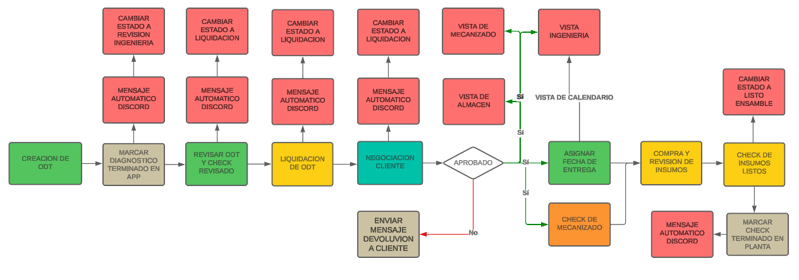

Se da inicio al proyecto interno en el que se busca integrar las 3 plataformas que hacen posible la gestion interna de la empresa tanto en ambitos de comunicacion como almacenamiento de datos.

En el primer commit se encuentran activas dos vistas para el usuario , aun no implementamos login con seguridad como lo seria la utilizacion de tokens y cookies sin embargo ya estamos interactuando con la base de datos de manera eficiente encaminando el proyecto hacia nuestro objetivo que es fraccionar la actualizacion de datos en las diferentes areas que integran el proceso.

En ese commit se lleva a cabo la implementacion de un login basico , se crean las bases de datos que comprenden los estados de algunos componentes asi como una tabla que se llena automaticamente con los clientes nuevos para efectos de adquision de datos, se implentaron los roles para direccionar las consultas y las vistas

Implementacion de direccionamiento y rutas protegidas

Se  implemetaron nuevas vistas, se creo el user almacen para la modificacion de insumos en el almacen , se creo una vista para la creacion de solicitudes de produccion , con el fin de garantizar control y trazabilidad a los procesos de compras de igual manera para el usuario de compras se habilito una vista adicional en la que puede tener el control de las solicitudes realizadas por parte de planta de manera centralizada, se estilizo el login y sera esta linea de diseno ya la que se maneje de ahora en adelante

Se implementan las vista para el supervisor y la notificacion por medio de Discord con el fin de tener la trazabilidad de los proceso en la empresa adicionalmente se dejan listos los flujos entre diagnostico terminado , revision de la odt , liquidacion y aprobacion tal como se muestra en la imagen

Tras la reunion realizada entre el area de ingenieria y gerencia se llegaron a las siguientes mejoras:
- Usuario para gerencia
- Usuario de cartera en pro de verificar las ODTs preaprobadas
- Usuario para Jeisson
- User vendedor puede modificar los precios de las ODTs
- Vista para mecanizado
- No aprobar sin OC
- Crear el historial de actividades
- Enviar mensaje con quien apruebas las ODTs

En este commit se esta gestionando la simplificacion del codigo en pro de hacer test en produccion , ya se completo el punto de los precios con los vendedores
Se inicia el proceso de implementacion de la vista de mecanizado

- mecanizado:
    - mC : mecanizado controller
        - fU : fecha Update
        - init : servir la vista
- compras:
    - cC : compras Controller
        - rL : referesh liquidaciones
        - s : solicitudes
        - serve : servir vista liquidaciones
        - aFS : actualizar fecha de solicitud
- historial:
    - mH : model historial
    - hS : historial setter
- routes : 
    r : router